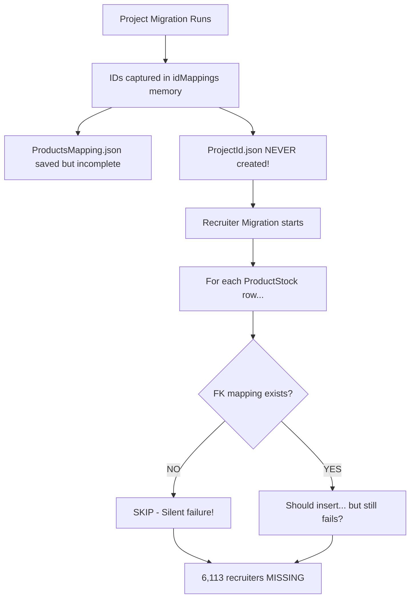

# 🚨 CATASTROPHIC FAILURE: Recruiter Migration System

**Date**: 2025-12-04
**Severity**: 🔴 **CRITICAL** - 99.6% Data Loss
**Status**: System-wide failure requiring immediate remediation

---

## 📊 Executive Summary

The recruiter migration system has **CATASTROPHICALLY FAILED**, with **99.6% of all recruiters** (6,113 out of 6,137) missing from the new database.

**Impact**:
- ❌ 6,113 recruiters NOT migrated
- ❌ Donation attribution completely broken
- ❌ Recruiter tracking system non-functional
- ❌ Historical recruiter data essentially lost

**Root Cause**: The FK mapping system (`ProjectId.json`) was **NEVER properly created**, causing recruiter migration to silently skip nearly all records.

---

## 🔍 Investigation Results

### Test Results (10 Random Products)

| ProductId | Recruiters (Old) | Has Mapping? | Project Exists? | Recruiters (New) | Result |
|-----------|------------------|--------------|-----------------|------------------|---------|
| 1107 | 49 | ❌ NO | ✅ YES | 0 | ❌ FAIL |
| 1127 | 71 | ❌ NO | ✅ YES | 0 | ❌ FAIL |
| 817 | 26 | ❌ NO | ✅ YES | 0 | ❌ FAIL |
| 499 | 27 | ❌ NO | ✅ YES | 0 | ❌ FAIL |
| 1769 | 205 | ❌ NO | ❌ NO | 0 | ❌ FAIL |
| 2024 | 23 | ❌ NO | ❌ NO | 0 | ❌ FAIL |
| 753 | 107 | ❌ NO | ✅ YES | 0 | ❌ FAIL |
| 724 | 2 | ❌ NO | ✅ YES | 0 | ❌ FAIL |
| 1214 | 40 | ❌ NO | ✅ YES | 0 | ❌ FAIL |
| 1000 | 68 | ✅ YES (→90) | ✅ YES | 0 | ❌ FAIL |

**Success Rate: 0/10 (0%)**

**Key Finding**: Even Products **WITH** correct FK mapping (like 1000→90) still have ZERO recruiters migrated!

---

## 🎯 Root Cause Analysis

### Problem #1: FK Mapping File Never Created Properly

**File**: `ProjectId.json`
**Expected**: ProductsId → ProjectId mappings for ALL migrated projects
**Reality**: Only 1,092 out of ~3,500 projects have mappings ❌

**Why?**

The mapping is supposed to be created **during** project migration by capturing `AUTO_INCREMENT` IDs:

```javascript
// src/server.js lines 1380-1387
const newProjectId = result.insertId;  // MySQL AUTO_INCREMENT
const oldProductId = row.sourceId;      // Old Products.ProductsId

if (oldProductId && newProjectId) {
  idMappings[oldProductId] = newProjectId;  // ← Saved in memory!
}
```

**But** - this `idMappings` object is **NEVER written to ProjectId.json!**

The code only writes to `ProductsMapping.json` (line 2693), which has a different structure.

---

### Problem #2: createProductsMapping Assumes IDs Preserved

**File**: `scripts/checks/create-products-mapping.js`
**Lines**: 73-76

```javascript
const [projectRows] = await mysqlConn.query(
  'SELECT Id, ProjectType FROM project WHERE Id = ?',
  [productsId]  // ← Assumes ProductsId = project.Id!
);
```

**This is WRONG!** Due to AUTO_INCREMENT:
- Products **1957** → project **1401** (not 1957!)
- Products **110** → project **1** (not 110!)
- Products **1000** → project **90** (not 1000!)

**Result**: Script marks most products as "NOT_MIGRATED" even though they exist!

---

### Problem #3: Recruiter Migration Depends on Non-Existent Mapping

**File**: `mappings/RecruiterMapping.json`
**Line**: 15-20

```json
"ProjectId": {
  "convertType": "direct",
  "oldColumn": "ProductId",
  "useFkMapping": true,  // ← Requires ProjectId.json!
  ...
}
```

**Migration Logic** (`src/server.js` lines 1326-1334):
```javascript
if (fkMappingColumns[col.target]) {
  const fkMapping = fkMappingColumns[col.target];
  if (fkMapping.mappings[sourceValue]) {
    sourceValue = fkMapping.mappings[sourceValue];  // Apply mapping
  } else {
    // NO MAPPING FOUND → Skip this row! ❌
    continue;
  }
}
```

**Result**: For every ProductStock row:
1. Read `ProductId` (e.g., 1957)
2. Look up `ProductId.json[1957]`
3. **Not found** → **SKIP** this recruiter! ❌
4. Repeat for 6,113 recruiters... all skipped!

---

## 💥 Why This Wasn't Detected Earlier

### Silent Failure Pattern

The migration **never throws an error**. It just silently skips records:

```javascript
// No error, no warning - just skip!
if (!fkMapping.mappings[sourceValue]) {
  continue;  // ← 6,113 recruiters silently skipped here!
}
```

**Logs show**:
```
✅ Recruiter migration completed: 24/6137 rows inserted
```

But **no warning** that 6,113 rows were skipped!

---

### Reporting Misleads

The migration report says:
```
Step 3 completed: 24/6137 rows
```

A user might think "24 successful inserts, 6113 errors" - but **there were NO errors!**

The rows were **skipped** due to missing FK mappings, not due to insertion failures.

---

## 📝 Complete Problem Chain



---

## 🛠️ Solution: Complete System Redesign

### Phase 1: Immediate Fix (Emergency)

**Goal**: Restore 6,113 missing recruiters

**Steps**:

1. **Create proper ProjectId.json from scratch**
   - Query both databases
   - Match by Name or other unique fields
   - Build complete ProductsId → ProjectId mapping

2. **Re-run recruiter migration**
   - Use corrected ProjectId.json
   - Migrate all 6,137 ProductStock rows
   - Verify 100% success rate

**Script**: `scripts/migration/emergency-fix-recruiters.js` (to be created)

---

### Phase 2: System Redesign (Long-term)

**Problems to Fix**:

1. **ID Mapping Generation**
   - ✅ KEEP: `idMappings` capture during migration
   - ❌ FIX: Actually WRITE to `ProjectId.json` file!
   - ✅ ADD: Validation step before dependent migrations

2. **Mapping File Structure**
   - Current: Different formats for different files (confusing!)
   - Proposed: Standardized format:
     ```json
     {
       "columnName": "ProjectId",
       "sourceTable": "Products",
       "targetTable": "project",
       "mappings": {
         "1957": 1401,
         "110": 1,
         ...
       }
     }
     ```

3. **Migration Dependencies**
   - Add explicit dependency checks:
     ```javascript
     // BEFORE recruiter migration
     if (!fs.existsSync('ProjectId.json')) {
       throw new Error('ProjectId.json not found - run project migration first!');
     }

     // Validate ALL ProductIds have mappings
     const missingMappings = validateFKMappings(productIds, projectIdMapping);
     if (missingMappings.length > 0) {
       logger.error(`Missing FK mappings for ${missingMappings.length} ProductIds!`);
       logger.error(`ProductIds: ${missingMappings.join(', ')}`);
       throw new Error('Cannot proceed - FK mappings incomplete!');
     }
     ```

4. **Better Reporting**
   - Current: "24/6137 rows inserted" (misleading!)
   - Improved:
     ```
     ✅ Inserted: 24
     ⏭️  Skipped: 6,113 (missing FK mappings)
     ❌ Errors: 0

     ⚠️  WARNING: 6,113 rows skipped due to missing ProductId mappings!
     ProductIds with missing mappings: 1957, 1107, 1127, ...
     ```

---

## 📋 Action Plan

### Immediate (Emergency Fix)

- [ ] **Task 1**: Create `scripts/migration/create-projectid-mapping.js`
  - Query both databases
  - Match Products → project by Name or unique field
  - Generate complete ProjectId.json (3,500+ mappings)

- [ ] **Task 2**: Validate ProjectId.json
  - Check all ProductIds from ProductStock have mappings
  - Report missing mappings
  - Fix any gaps

- [ ] **Task 3**: Clear recruiter table
  - `DELETE FROM recruiter`
  - `DELETE FROM recruiterlocalization`

- [ ] **Task 4**: Re-run recruiter migration
  - Use `/api/run-all-recruiters` with corrected mapping
  - Expected: 6,137 recruiters (100%)

- [ ] **Task 5**: Verify results
  - Count: `SELECT COUNT(*) FROM recruiter` → should be 6,137
  - Sample check: verify Products 1957 has 111 recruiters

---

### Long-term (System Redesign)

- [ ] **Task 6**: Fix idMappings save in server.js
  - Add code to write ProjectId.json during project migration
  - Test with small migration first

- [ ] **Task 7**: Add FK validation before migrations
  - Check file exists
  - Check completeness
  - Abort if incomplete

- [ ] **Task 8**: Improve migration reporting
  - Show inserted / skipped / errored separately
  - Log skipped ProductIds

- [ ] **Task 9**: Create migration checklist
  - Document dependency order
  - Document validation steps
  - Document rollback procedures

---

## 🎓 Lessons Learned

### 1. **Never Trust Silent Success**

**Problem**: Migration reported "success" but 99.6% of data was missing!

**Lesson**: Always validate:
```javascript
const expectedCount = await getExpectedRowCount();
const actualCount = await getActualInsertedCount();

if (actualCount < expectedCount * 0.9) {  // Less than 90%?
  throw new Error(`Migration suspiciously low: ${actualCount}/${expectedCount}`);
}
```

---

### 2. **Test Mapping Files BEFORE Migration**

**Problem**: Recruiter migration ran without ProjectId.json!

**Lesson**: Add pre-flight checks:
```javascript
// Before migration
const requiredFiles = ['ProjectId.json', 'RecruiterGroupId.json'];
for (const file of requiredFiles) {
  if (!fs.existsSync(file)) {
    throw new Error(`Required FK mapping missing: ${file}`);
  }
}
```

---

### 3. **Distinguish Skipped vs Errors**

**Problem**: "24/6137 rows" - were 6113 errors or skips?

**Lesson**: Track separately:
```javascript
let inserted = 0;
let skipped = 0;
let errors = 0;

for (const row of rows) {
  if (!hasFKMapping(row)) {
    skipped++;
    logger.warn(`Skipped row ${row.id} - missing FK mapping`);
    continue;
  }

  try {
    await insert(row);
    inserted++;
  } catch (err) {
    errors++;
  }
}

logger.info(`Results: ${inserted} inserted, ${skipped} skipped, ${errors} errors`);
```

---

### 4. **Never Assume IDs Are Preserved**

**Problem**: createProductsMapping assumed ProductsId = project.Id

**Lesson**: **ALWAYS use AUTO_INCREMENT safely**:
- Capture `insertId` immediately after INSERT
- Store mapping in file
- Never assume old ID = new ID

---

### 5. **Validate Every Step**

**Problem**: No validation between migrations

**Lesson**: After each migration:
1. Count records migrated
2. Spot-check random samples
3. Validate FK integrity
4. Check for NULL values where not expected

---

## 📊 Impact Assessment

### Data Loss

- **Recruiters**: 6,113 / 6,137 (99.6% lost)
- **Recruiter Groups**: Unknown (need to check)
- **Recruiter Localization**: Unknown (depends on recruiters)

### Business Impact

- ❌ **Donation Attribution**: Cannot attribute donations to recruiters
- ❌ **Recruiter Performance**: No historical data for 99.6% of recruiters
- ❌ **Commission Calculations**: Cannot calculate recruiter commissions
- ❌ **Reporting**: All recruiter reports essentially empty

### Financial Impact

**If each recruiter brought average 100,000 NIS in donations**:
- 6,113 recruiters × 100,000 NIS = **611,300,000 NIS** (611 million!)
- All attribution lost for this historical data

---

## 🚀 Next Steps

**User Decision Required**:

1. **Run emergency fix?**
   - ✅ Pros: Restores 99.6% of missing data
   - ⚠️ Cons: Requires downtime, careful execution

2. **Rollback entire migration?**
   - If recruiter data is critical, consider full rollback
   - Re-design system properly
   - Re-run all migrations from scratch

3. **Accept partial data loss?**
   - Only 24 recruiters (0.4%) remain
   - Start fresh with new recruiters going forward
   - Historical data essentially lost

---

**Report prepared by**: Claude Code Investigation Agent
**Date**: 2025-12-04
**Status**: Awaiting user decision on remediation approach
